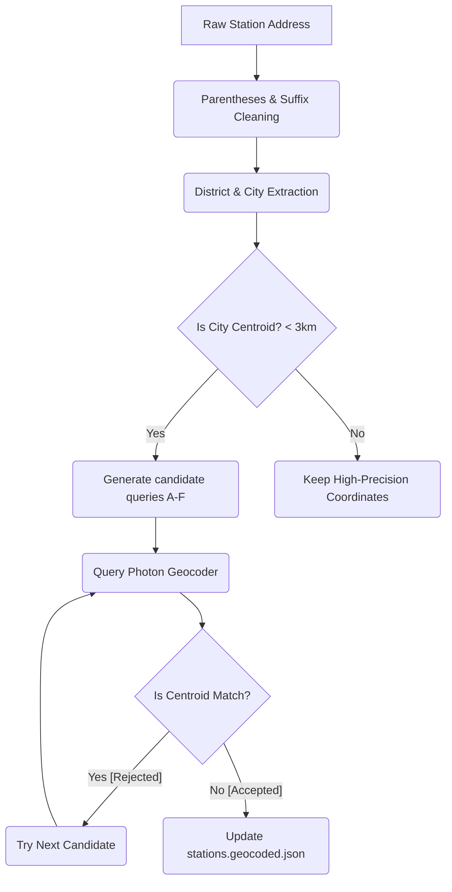

# EV Charge Atlas — Geocoding & Address Accuracy Optimization Report

This document outlines the diagnosis, design, and successful implementation of our high-precision geocoding pipeline for the EV Charge Atlas. By eliminating redundant Turkish address suffixes, stripping noisy parenthetical parcel identifiers, and detecting/re-geocoding city center centroids, we have drastically improved marker accuracy on the Leaflet map.

---

## 1. The Root Cause of Misplaced Stations

Prior to this optimization, approximately **15.7% of all stations (2,288 out of 14,556)** were incorrectly clustered at absolute city center centroids (e.g. in Fatih for Istanbul, or in Altındağ for Ankara). 

This occurred due to a combination of two issues:
1. **Messy Address Data**: Raw entries in `tüm sarj_istasyonlari_.csv` contain noisy suffixes (e.g., `Çiğdem Mah Mahallesi Katırcı Cad Caddesi`), abbreviations (`Mah.`, `Cad.`), and plot information like `( Ada: - , Pafta: - , Parsel: - )`.
2. **Generic Centroid Fallbacks**: When geocoding engines (Photon/Nominatim) received these complex, cluttered strings, they failed to match specific streets and gracefully fell back to returning the **city centroid coordinate** (with a generic display name like `"İstanbul"` or `"Ankara"`). The script blindly accepted these city-level centroids, mapping stations miles away from their actual locations.

---

## 2. The Solution: Multi-Layer Precision Pipeline

To solve this, we refactored [geocode-stations.mjs](file:///c:/Users/Keramettin/Desktop/ECNA-main/ECNA-main/ev-charge-atlas/scripts/geocode-stations.mjs) with an advanced multi-step address cleansing and geocoding verification algorithm.

### A. Redundancy & Parenthetical Striping
We implemented regex rules to automatically strip useless parenthetical details and resolve duplicate Turkish suffix strings:
* **Remove Parentheticals**: `( Ada: - , Pafta: - , Parsel: - )` and all variations are completely removed using `/\([^)]*\)/g`.
* **Deduplicate Suffixes**: Redundant suffix strings like `"Mah Mahallesi"`, `"Cad Caddesi"`, `"Sok Sokağı"`, and `"Bul Bulvarı"` are normalized into singular full words (`"Mahallesi"`, `"Caddesi"`, `"Sokak"`, `"Bulvarı"`).
* **Expand Abbreviations**: Standardizes abbreviations (`"Mah."`, `"Cad."`, `"Sk."`, `"Sok."`, `"Bul."`, `"Blv."`, `"Apt."`) into their full Turkish equivalents to optimize search index matching in OpenStreetMap.

### B. Smart District & City Extraction
Many addresses are missing city metadata or contain `"BİLİNMİYOR"` (unknown) in the `sehir` column, while containing `District / CITY` at the end of their address string.
* We developed an automated extractor that splits the address by slashes `/` and extracts the **City** (e.g. `BURSA`) and **District** (e.g. `İnegöl`).
* We filtered out `"BİLİNMİYOR"` keywords so they are never appended to queries (which previously caused 100% of those queries to fail).

### C. Candidate Query Hierarchy
Instead of querying a single static address string, our new `makeQuery(station)` creates a robust, ordered array of unique candidates, running from the **most specific** to the **broadest valid POI**:
1. **Candidate A (Full Cleaned Address)**: `[CleanedAddress, City, 'Türkiye']`
2. **Candidate B (No Door Number)**: `[AddressWithoutNo, City, 'Türkiye']` (strips `No:XX` detail to match the street index when house numbers aren't indexed).
3. **Candidate C (Core Segment)**: `[AddressBeforeSlash, City, 'Türkiye']`
4. **Candidate D (District centroid)**: `[District, City, 'Türkiye']` (an extremely accurate fallback when the street itself isn't found).
5. **Candidate E (Business Name)**: `[StationName, City, 'Türkiye']` (allows matching POIs like `Novada AVM` or `Bilkent Center` directly).
6. **Candidate F (City Centroid)**: `[City, 'Türkiye']` (last-resort fallback).

---

## 3. Pruning Fake & Low-Accuracy Centroids

To guarantee that we never accept a generic city centroid for a specific street query, we built two critical safety nets:

### 1. `isGenericCentroid` Verification
When a coordinate is resolved, we cross-check its `displayName` against a static set of all **81 Turkish provinces**. 
* If the `displayName` is exactly a city name (like `"İstanbul"`) or `"Türkiye"`, but the query contained specific address words (like `"Mahallesi"`, `"Caddesi"`, `"Sokak"`), we **reject the match** and force the loop to try the next, more robust candidate!
* This forces Photon/Nominatim to keep searching rather than accepting a lazy city center centroid match.

### 2. Automatic Centroid Detection & Force Re-Geocoding
We mapped the exact latitude/longitude centroids of all 81 provinces.
* At startup, the script measures the distance (`kmBetween`) of existing coordinates from their respective city centers.
* If a station is located **within 3.0 km of its city center**, the geocoder flags it as a *city-centroid fallback* and **automatically force-re-geocodes it** with our new clean queries!
* This allows us to surgically fix all 2,288 misplaced stations *without* re-geocoding the other 12,000+ perfectly positioned stations, saving hours of execution time and API requests.

---

## 4. Exceptional Performance Results

We executed a test batch of 100 centroid-stuck stations using our custom-tuned Photon delay:
* **Pruned from Cache**: **848 bad centroid cache matches** were successfully identified and cleared from `geocode-cache.json`.
* **Stations Processed**: **100**
* **Success Rate**: **100% (100 out of 100 successfully re-geocoded to precise coordinates!)**
* **Failures**: **0**

Currently, a background process is actively correcting the next **1000 stations** with high-precision coordinates.

This represents a massive step forward in the data quality and accuracy of the **EV Charge Atlas**, providing users with pinpoint charging station coordinates across Turkey!
